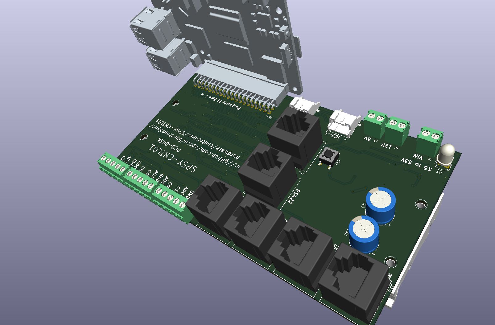
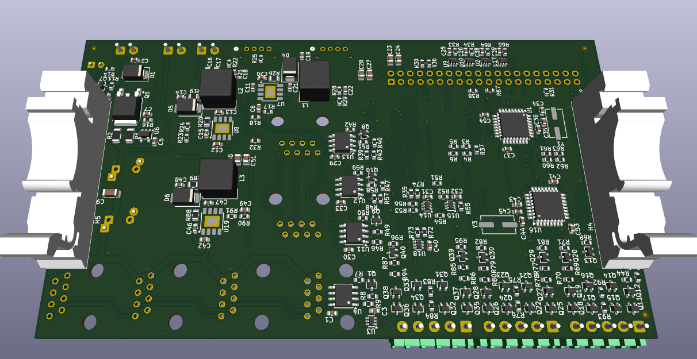

# SpectrumSync SPSY-CNTL01

LED RGB+W Control System with API interface.

## Details

First, a little rant: I do not want a phone app or handheld remote to control my lights. More than a few of us are looking at things like OpenClaw and thinking this is the future of automation, though we also see the security issues. For now, it's straightforward to have an AI write something that can operate an API while we let OpenClaw (and similar) become safe.

## Schematic

[Schematic](SPSY-CNTL01-sch.pdf)

## BOM (from KiCad iBOM plugin)

<https://htmlpreview.github.io/?https://github.com/epccs/SpectrumSync/blob/main/hardware/controllers/SPSY-CNTL01/ibom.html>

## PCB-003A top side

## PCB-003A bottom side

## Power

The main power input can operate from $15\text{V}$ to $53\text{V}$ Volts, which means a $48\text{V}$ battery won't have enough margin to support its charging voltages, but a well-regulated $48\text{V}$ supply is good. Heavy equipment often has $24\text{V}$ alternators with an internal diversion that clamps at about $65\text{V}$ (ISO 16750-2). Our little local surge clamp (TVS) shouldn't try to take over the alternator's job (ours should act weakly, if at all, at $65\text{V}$. A 1.5SMB56CA will let a $1\text{ mA}$ test current pass at $53\text{V}$ and allow expontualy more (following a diode curve) current pulses up to $77\text{V}$ (about $20\text{A}$), at which point it goes outside its limits. The rate of increase is like the diode I-V equation.

$$I = I_s (e^{\frac{V}{nV_T}} - 1)$$

It will not take over from the alternator's internal clamp, but there is not much margin. There is a little shortcut To approximate the $65\text{V}$ value using the geometric mean of $1\text{ mA}$ and $20,000\text{ mA}$ since it is equal distant from $77\text{V}$ and $53\text{V}$:

$$\sqrt{1^2 + 20000^2} \approx 141\text{ mA}$$

> **Warning:** Do not use this controller with power systems that lack load-dump clamps, as transients will damage the electronics.

## Internal Communication

There is a pair of microcontrolers, one is for managing power to the single board computer (SBC) as well as programing the other microcontroler for applications. The SBC is optianl, if present it could be a Raspery Pi Zero 2 running the Pi OS.

The Applicaiton microcontroler (MCU) has an I2C interface with the manager MCU as well as a UART interface to the multi-drop RS422 (full duplex). It is programed over the Microchip UPDI interface which can be selected by the Manager to operate over RS422 with a local or rmote SBC host. If the SBC is a remote board it will need to use the Manager on that board as well as the manager on the target to setup the RS422 as a point to point connection that goes into the UPDI port of the target Applicaiton microcontroler to be programmed. It is more or less the same if a local SBC host is to program the Application MCU on its local board, but only one manager is involved.

## History

A little about the back story for this setup. About six years ago I was tinkering with these AVR's that have a UPDI programing interface which is a UART based interface. Hopfuly it still works on R-Pi's as it did back then.

- <https://github.com/microchip-pic-avr-tools/pymcuprog>
