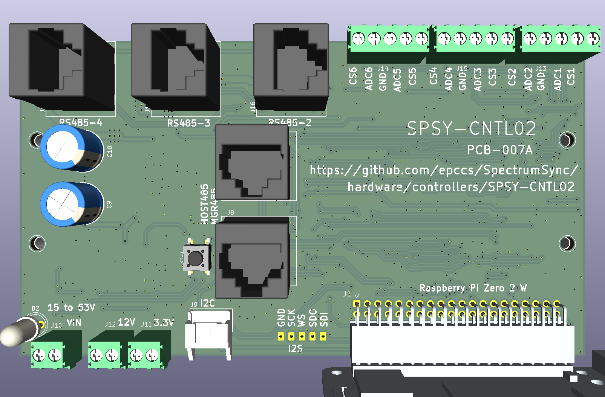
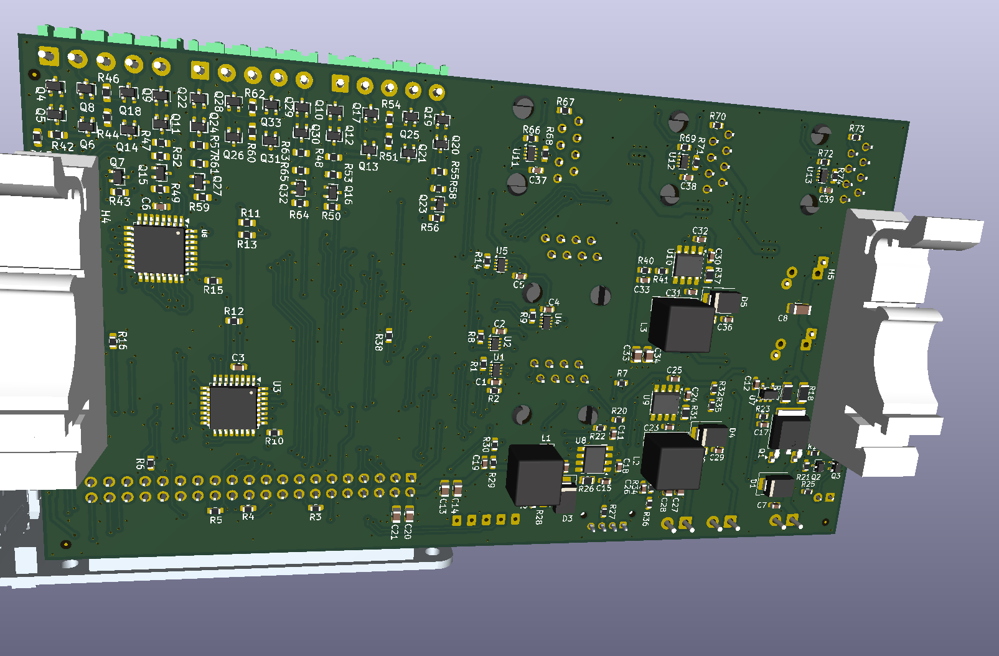
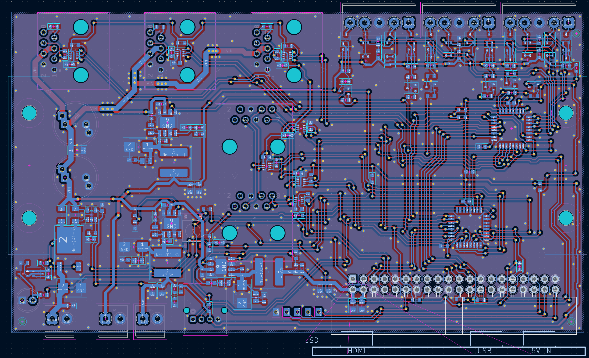

# SpectrumSync SPSY-CNTL02

Three RS458 channels from STM32C092.

## Details

There are two STM32C092 on this board. One is refered to as a manager the other is for applications. First goal is to bootload the manager from the R-Pi, then with approprate fw in manager bootload the application MCU. The app MCU has an SPI connection with the R-Pi and four USARTs (three for RS485 channels, and one goes to RS485 that has a R-Pi or other host connected).

## Schematic

[Schematic](SPSY-CNTL02-sch.pdf)

## BOM (from KiCad iBOM plugin)

<https://htmlpreview.github.io/?https://github.com/epccs/SpectrumSync/blob/main/hardware/controllers/SPSY-CNTL02/ibom.html>

## PCB-007A top side

> **Note:** A R-pi 5 is shown in image since the R-pi foundation has a STEP model for it, unfortunaly this board will not power an R-pi 5.

## PCB-007A bottom side

## PCB-007A layout

## Power

The main power input can operate from $15\text{V}$ to $53\text{V}$ Volts, which means a $48\text{V}$ battery won't have enough margin to support its charging voltages, but a well-regulated $48\text{V}$ supply is good. Heavy equipment often has $24\text{V}$ alternators with an internal diversion that clamps at about $65\text{V}$ (ISO 16750-2). This boards local surge clamp (TVS) shouldn't try to take over the alternator's job (it should act weakly, if at all, at $65\text{V}$. A 1.5SMB56CA will let a $1\text{ mA}$ test current pass at $53\text{V}$ and allow expontualy more (following a diode curve) current pulses up to $77\text{V}$ (about $20\text{A}$), at which point it goes outside its limits. The rate of increase is like the diode I-V equation.

$$I = I_s (e^{\frac{V}{nV_T}} - 1)$$

It will not take over from the alternator's internal clamp, but there is not much margin. There is a little shortcut To approximate the $65\text{V}$ value using the geometric mean of $1\text{ mA}$ and $20,000\text{ mA}$ since it is equal distant from $77\text{V}$ and $53\text{V}$:

$$\sqrt{1^2 + 20000^2} \approx 141\text{ mA}$$

> **Warning:** Do not use this controller with alternator-based power systems that lack load-dump protection, as the TVS is insufficient to handle the inductive kickback.

## Internal Communication

There is a pair of microcontrolers, one is for managing power to the single board computer (SBC) as well as programing the other microcontroler for applications. The SBC is optianl, if present it could be a "Raspery Pi Zero 2 W" running the Pi OS.

The Applicaiton microcontroler (MCU) has a I2C interfaces with the manager MCU and header (Jtbd and Jtbd) as well as a USART interface to the multi-drop RS485 (Jtbd and Jtbd). It is programed over the its USART1 bootload interface which can be selected by the Manager with the APP_BOOT0 and APP2HOST485 nodes to operate over the HOST485 multi-drop from a local or remote SBC host. If the SBC is a remote it will need to use all the managers with MGR485 to target a point to point connection that goes form the host SBC to the Applicaiton microcontroler.

The Manager microcontroler can be programed with MGR_BOOT0 and MGR2HOST485 from a local SBC host.
