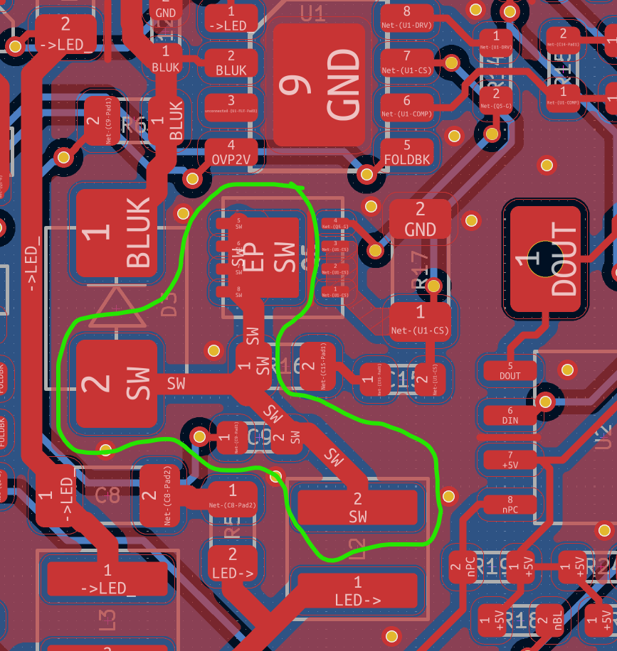
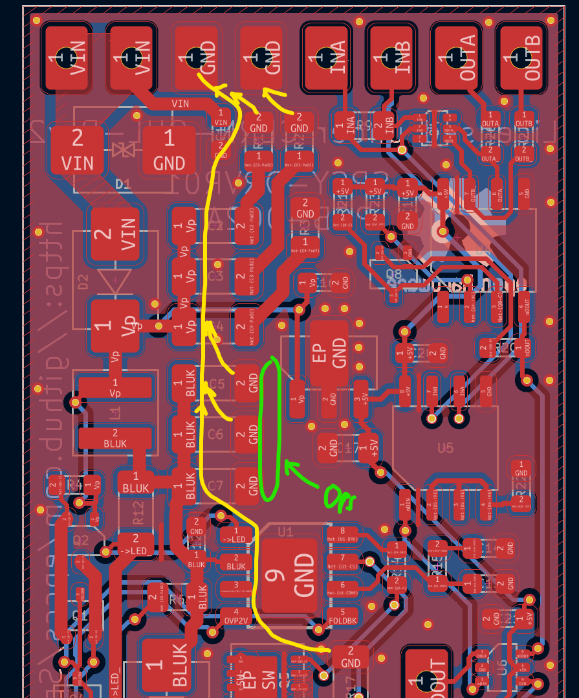
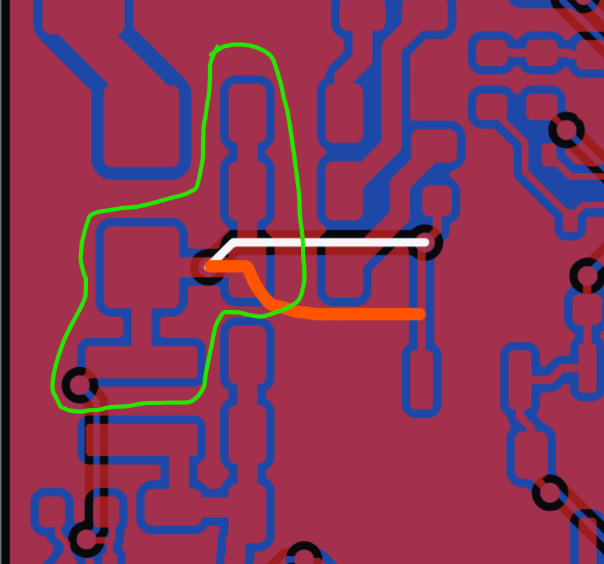

# Design Notes for SPSY-DRVR01

LED driver and RGB+W control

## Switch Node

The switch node voltage swings a little above the input voltage, when diode voltage D3 conducts, and near ground when Q5 conducts. The near square wave capacitively couples to everything near it, but keep in mind that the E-field spreads out like rays in 3-D space from the edges of the switch node and then bends back into lower potentials (they follow a similar pattern to iron filings near a magnet). If we wrap ground around and under the switch node most of the field lines will bend into that rather than other circuit nodes. The green line in the image shows the top side ground loop.

On the bottom under the switch node is solid ground, no traces break the bottom ground pour under the switch node. This is also how crystals should be done, but the reason is a little different. It turns out that immunity is the flip side of emission; circuit nodes with low emission also have high immunity, and in the case of a crystal, immunity means more precise time keeping.

An improved ground would include a via fence around the switch node.

<https://electronics.stackexchange.com/questions/41871/via-fences-for-noise-reduction-of-a-chip-antenna>

## Return Current from the Driver

It is well worth looking at and thinking about the return current.

However, one thing: I forgot to put vias between top and bottom near the bulk capacitors.

Typically, the smaller loop(s) of ground pour around nodes, the better the return path. If the trace follows the orange highlight on the top side, the return path significantly increases.

The sense resistor under the switching MOSFET (R17) is dumping the switching current onto the top side ground and it is away from the bulk capacitors, which causes nasty disturbances on the ground. I should move it to dump near the bulk capacitors and not let the disturbance flow on the ground.
