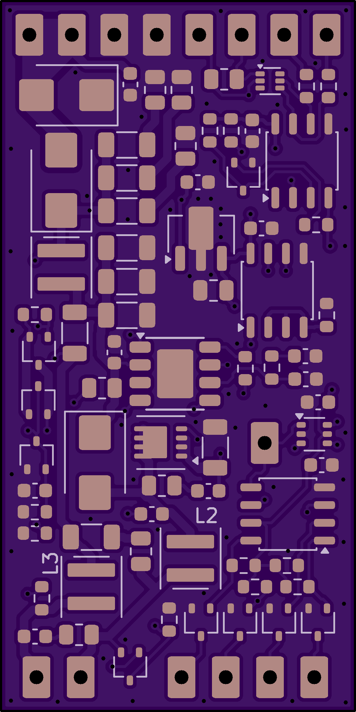
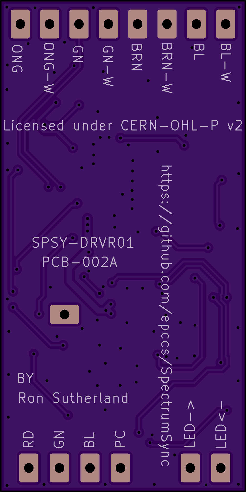

# SpectrumSync SPSY-DRVR01

LED driver and RGB+W control

## Details

Driver expects DC voltage input (9 to 53V) and outputs constant current (2A) to drive an LED string. An WS2814A is used to operat shorts in the LED string to bypass the constant current around individual LEDs, this is how colors are enabled or disabled. Through the magic of logical inversion the high power LEDs are ON durring the expected time, in other words it works like a NeoPixel but has four bytes of data (each of the four channels uses a byte).

The FastLED library for colored LED animation might work with it (TBD.)

Adafruit Neopixel library might also work (e.g., Arduino "Adafruit_NeoPixel leds(NUMPIXELS, PIN, NEO_GRBW + NEO_KHZ800);")

## Schematic

[Schematic](SPSY-DRVR01-sch.pdf)

## BOM (from KiCad iBOM plugin)

<https://htmlpreview.github.io/?https://github.com/epccs/SpectrumSync/blob/main/hardware/drivers/SPSY-DRVR01/ibom.html>

## PCB-002A top side

## PCB-002A bottom side

## Open Hardware Licensing Recommendations

<https://gemini.google.com/share/2dea24fdcb34>