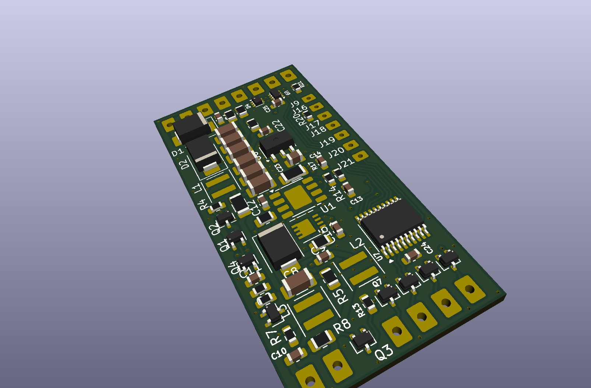
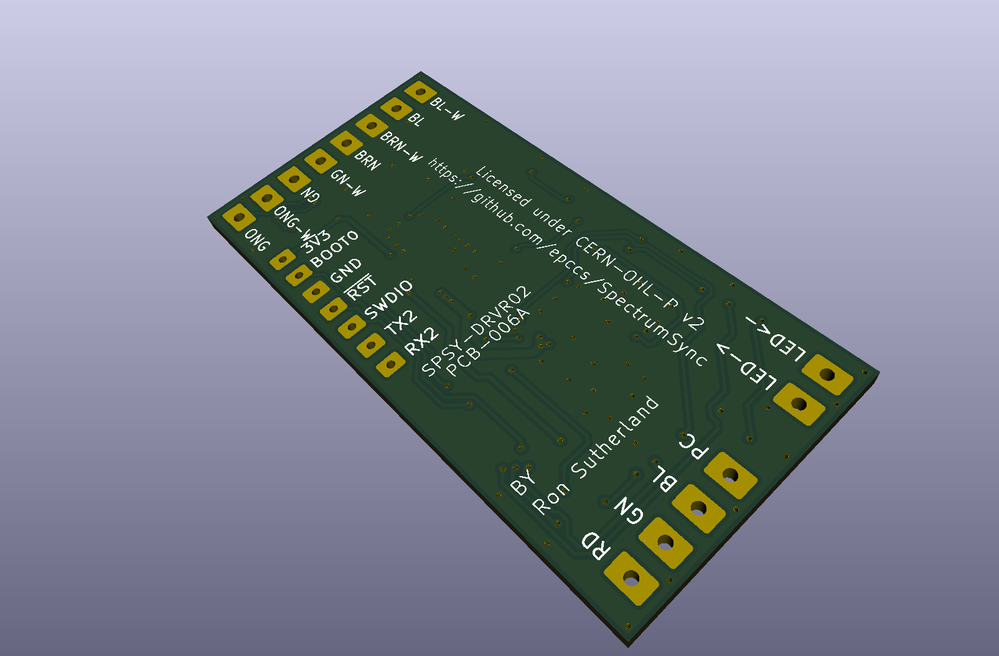

# SpectrumSync SPSY-DRVR01

LED driver and RGB+W control

## Details

Driver expects DC voltage input (9 to 53V) and outputs constant current (2A) to drive an LED string. An STM32C092 is used to operat shorts in the LED string to bypass the constant current around individual LEDs, this is how colors are ON or OFF.

Interface options:

- [DmxPy](https://github.com/davepaul0/DmxPy)
- [ola](https://github.com/OpenLightingProject/ola)
- [QLC+ lighting control](https://github.com/mcallegari/qlcplus)
- tbd

## Schematic

[Schematic](SPSY-DRVR02-sch.pdf)

## BOM (from KiCad iBOM plugin)

<https://htmlpreview.github.io/?https://github.com/epccs/SpectrumSync/blob/main/hardware/drivers/SPSY-DRVR02/ibom.html>

## PCB-006A top side

## PCB-006A bottom side

