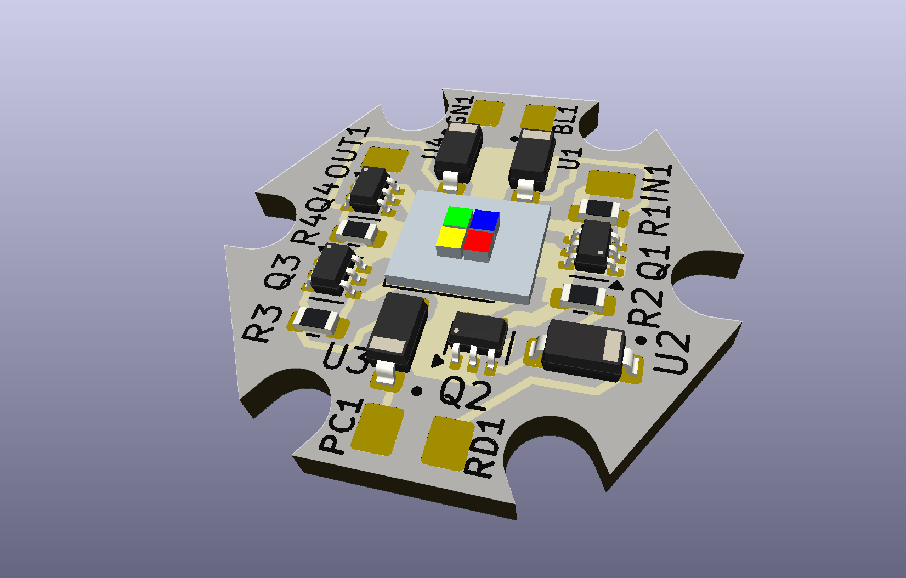

# SpectrumSync SPSY-CREE-XNP

Insulated Metal Substrate (IMS) board with a Cree XP-N RGB+W and P-channel MOSFET (PMOS) bypass for a controller to operate.

## Details

A current source is needed to drive a constant current through the string of four LEDs (in the Cree XP-N device). On board, PMOS shunts are used to allow the current to bypass each LED with external control. The shunts don't block the current, so other LEDs in the string can still output light. When a shunt is turned on, current will begin to bypass the LED. Unfortunately, the driver's capacitance will discharge, causing a current surge. The SPSY-DRV01 mitigates the surge problem; other LED drivers will probably need a power resistor (e.g., >5 Ohm, 20W) to reduce the surge to survivable levels.

## Schematic

[Schematic](SPSY-CREE-XNP-sch.pdf)

## BOM (from KiCad iBOM plugin)

<https://htmlpreview.github.io/?https://github.com/epccs/SpectrumSync/blob/main/hardware/led-boards/SPSY-CREE-XNP/ibom.html>

## PCB-001A top side

